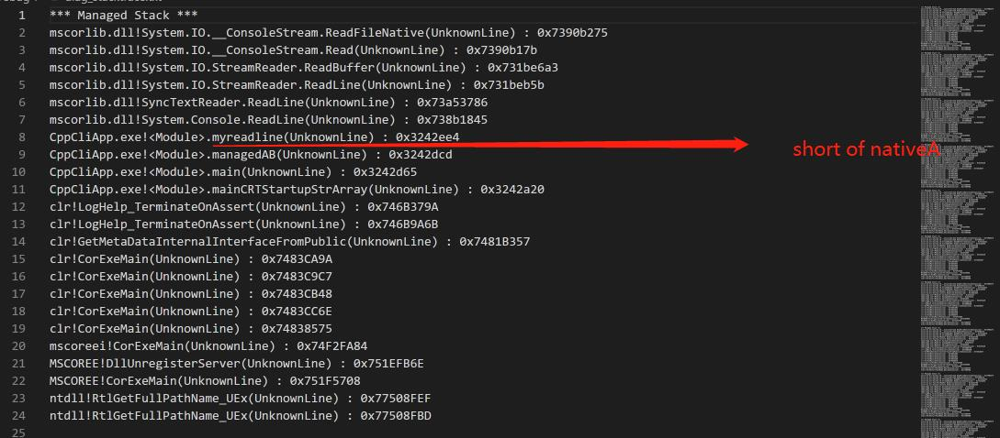

this project is from https://www.codeproject.com/Articles/384514/Building-a-Mixed-Mode-Sampling-Profiler?msg=5890001#xx5890001xx. it's amazing work. now I meet some issues and create this repo for asking Mattias some questions.

Hi, Mattias. Thanks for your help. I have tried your provided ways. But it still not works for me.

the real callstack of CppCliApp.exe should show as follow:

myreadline  
nativeA  
managedAB 
main

issuse:
native function(nativeA) do not show in Debug/diag_stackstrace.txt.


i have changed `profile.bat` and add `ForceLoad` in `NativeStackwalker` following  your advice. besides, both procedure from the same compilation. 

And then running `profile.bat` in Debug folder will show debug info in `verbose.txt` and  `diag_debugtrace.txt` and show callstack in `diag_callstacktrace.txt`. which info also shows `Error: SymGetSymFromAddr64() failed. Module = UnknownModule Addr64 = 0x035B2E70 BaseAddr = 0x00000000`. when i invoke `GetLastError`, it returns `126`.

I am new to windbg before, so i spend some time on it. that's really a better tool for debuging. below is my steps.
replace `CppCliApp` to `windbg.exe`, run `profiler.bat` and then open `CppCliApp.exe` in `windbg`. 
```
.sympath+ D:\junFiles\IProfiler\MixedModeProfiler_src\MixedModeProfiler_src\IProfiler\IProfiler\MixedModeProfiler_src\MixedModeProfiler_src\DiagProfiler\Debug;
```
Then, i run `lm`, it shows as below:

Does the `nativeA` name save in `CppCliApp.pdb`? it seems i should load `CppCliApp.pdb` manually.
[](./fig/windbg.jpg)

So run `profiler.bat` again, the pdb seems load successfully, but it still do not work(not show nativeA).
```
.sympath+ D:\junFiles\IProfiler\MixedModeProfiler_src\MixedModeProfiler_src\IProfiler\IProfiler\MixedModeProfiler_src\MixedModeProfiler_src\DiagProfiler\Debug;
.reload /f /i .reload /f /i D:\junFiles\IProfiler\MixedModeProfiler_src\MixedModeProfiler_src\IProfiler\IProfiler\MixedModeProfiler_src\MixedModeProfiler_src\DiagProfiler\Debug\CppCliApp.exe
```
[](./fig/windbg2.jpg)